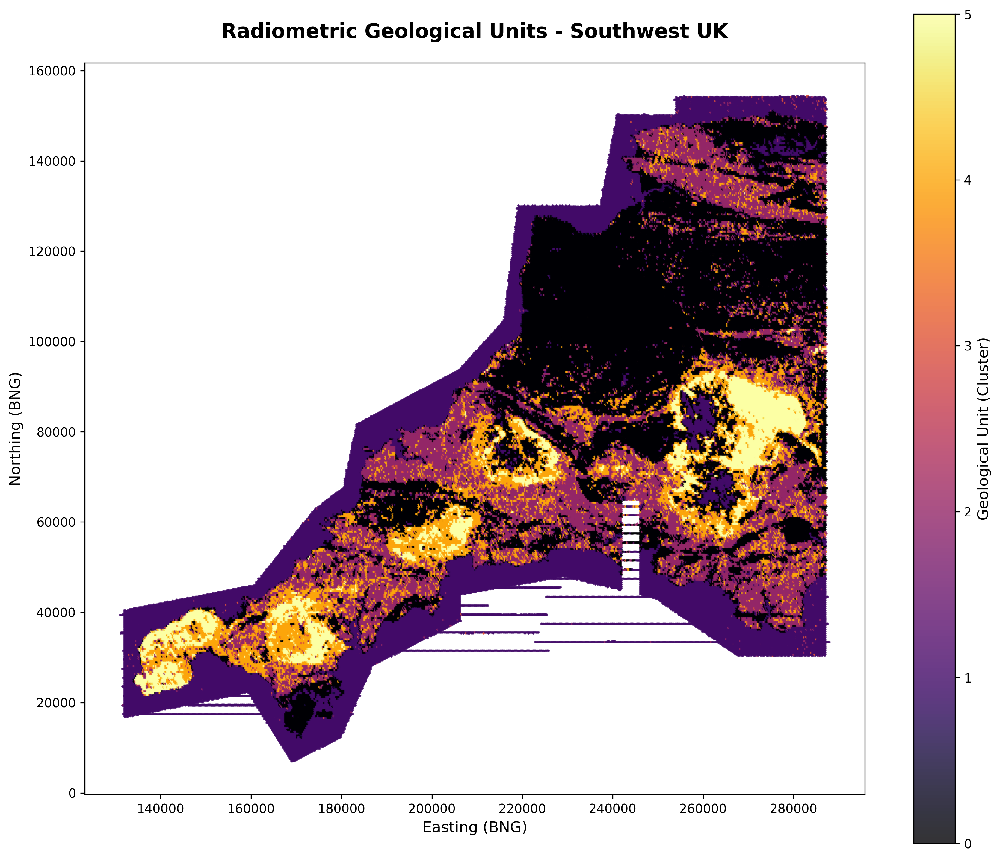
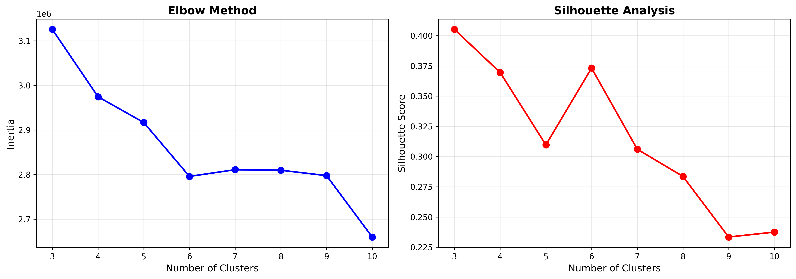
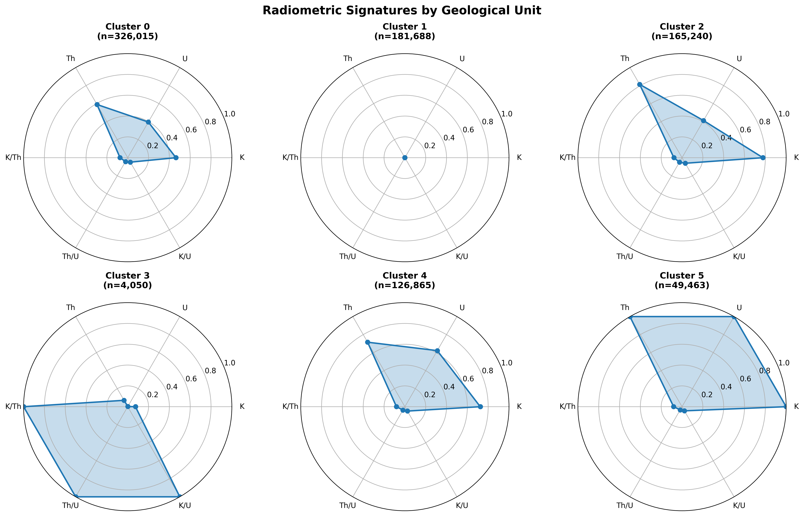

# Radiometric Clustering Analysis - Southwest UK

Automated geological classification of Southwest England using airborne radiometric survey data and unsupervised machine learning.



## Summary

This project applies K-means clustering to 853,000+ radiometric survey measurements across Southwest England. The analysis identifies six distinct geological zones based on potassium, uranium, and thorium signatures, with Cluster 5 showing strong spatial correspondence to the five major granite plutons in Cornwall and Devon.

---

## Notebooks

### 1. Data Exploration
**`01_pyplot_radiometrics.ipynb`** - Initial visualization of uranium distribution using hexbin plots to identify spatial patterns.

---

### 2. Interactive Mapping
**`02_folium_radiometrics.ipynb`** - Creates interactive heatmap for detailed exploration of radiometric data (generates 156MB HTML file).

---

### 3. Clustering Analysis
**`03_k_means_clustering_analysis.ipynb`** - Main analysis: feature engineering, cluster optimization, and geological classification.

#### Cluster Optimization

*Elbow method and silhouette analysis both indicate k=6 as optimal*

#### Cluster Characteristics

*Radar charts showing the unique radiometric signature of each geological unit*

#### Final Classification

*Six distinct geological zones identified - Cluster 5 (yellow) represents granite plutons*

---

## Results

### Key Findings

- Applied elbow method and silhouette analysis to determine optimal cluster count of k=6
- Generated radar charts characterizing the radiometric signature of each cluster
- Produced spatial classification map showing six distinct geological zones across the survey area
- Cluster 5 demonstrates strong spatial correspondence with known granite plutons (Dartmoor, Bodmin Moor, Land's End, St. Austell, Carnmenellis)
- Intermediate clusters capture transition zones and metamorphic aureoles surrounding granite bodies

---

## Method Summary

The analysis begins with raw radiometric measurements of potassium, uranium, and thorium concentrations. Geologically meaningful ratios (K/Th, Th/U, K/U) are calculated to enhance classification, as these ratios can indicate rock type, weathering intensity, and alteration zones. All features are standardized to zero mean and unit variance before applying MiniBatchKMeans clustering with k=6, producing the final geological classification map.

---

## Data & Setup

### Data Source
[TELLUS South West Airborne Geophysical Survey](https://www.tellusgb.ac.uk/data/airborneGeophysicalSurvey.html)
- Download `TellusSW_RAD_ALL.csv`
- Place in `data/` directory

### Requirements
```bash
pip install numpy pandas matplotlib scikit-learn folium
```

### Run Analysis
```bash
jupyter notebook notebooks/03_k_means_clustering_analysis.ipynb
```

---

## Conclusions

This analysis demonstrates that unsupervised machine learning can effectively classify geological units from radiometric data without prior training labels. The inclusion of element ratios as features significantly enhances classification by capturing geologically meaningful relationships between elements. Spatial validation against published geological maps confirms the reliability of the clustering approach, with particularly strong agreement for high-radioactivity granite bodies. This methodology shows potential for rapid geological assessment applications in land management and environmental monitoring.
